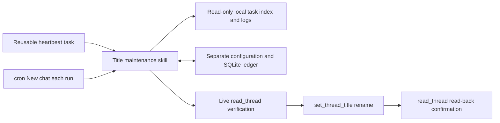

# Codex Task Title Maintenance

[🇨🇳 中文](README.md) | [🇬🇧 English](README.en.md)

[MIT License](LICENSE)

Standardize manageable local Codex task titles as `Prefix｜Short title｜MMDD`. The skills support a first full scan, incremental discovery by `updated_at`, manual preview and scans, scheduled maintenance through either a reusable heartbeat task or cron “New chat each run”, and configurable execution model, time window, and naming rules.

This repository provides two skills:

| Skill | Purpose |
|---|---|
| `codex-title-maintenance` | Scanning, naming, state maintenance, scheduling controls, and configuration |
| `codex-title-maintenance-setup` | First-time setup with default or custom preferences, plus guidance on everyday use |

The setup skill depends on the main skill; the implementation exists in one place only. The main skill includes its code and default templates, so installing the skill directory is sufficient.

## 📥 Installation and first use

In Codex, send the following request to install both skill directories:

```text
Please use $skill-installer to install both skills from tyler4400/codex-title-maintenance:
- skills/codex-title-maintenance
- skills/codex-title-maintenance-setup
```

Follow the installer’s prompt so Codex recognizes the newly installed skills, then send:

```text
$codex-title-maintenance-setup Guide me through first-time setup. The default settings are fine.
```

The setup checks the main skill, runtime, and available capabilities; creates only missing personal configuration; and explains how to operate the skills. Existing configuration is preserved. **Installation and initialization do not automatically rename tasks, change the current task’s model, or enable a schedule.**

To customize it, describe your preferences directly:

```text
$codex-title-maintenance-setup Use China Standard Time and run at 12:00 and 21:00 each day.
Set a 10-minute launch window. Show me the naming rules before saving the configuration.
```

## ▶️ Everyday operations

The following are instructions for the Codex skill, not shell commands:

| Request | Behavior |
|---|---|
| `$codex-title-maintenance preview full` | Preview all full-scan candidates without renaming anything |
| `$codex-title-maintenance scan full` | Rediscover all in-scope tasks and process them |
| `$codex-title-maintenance scan incremental` | Discover and process changes since the last scan |
| `$codex-title-maintenance start` | Enable future scheduled maintenance without an extra immediate scan |
| `$codex-title-maintenance stop` | Disable automatic maintenance while retaining progress and manual scans |
| `$codex-title-maintenance status` | Show enablement, watermark, pending work, and errors |
| `$codex-title-maintenance configure` | View or adjust personal configuration and rules |
| `$codex-title-maintenance doctor` | Check the environment, storage format, and supported scope |
| `$codex-title-maintenance unprotect <task ID>` | Resume management of one task protected after an external title change |

For a first run, preview first, perform a full scan, then use `start` only if scheduled maintenance is wanted. If the first full scan is incomplete, a formal incremental scan completes full discovery first. A manual full scan neither clears history nor force-rewrites every title, and it does not automatically remove external-title protection.

There are two formal scheduling modes: cron / New chat each run binds to a project and creates a new task on every run; heartbeat binds to, and reuses, one user-selected maintenance task. Heartbeat is best used with a dedicated task and is created only when the user requests it. Installing the skill never changes the model of a current development or business task automatically.

Choose based on your workflow: if reducing maintenance-task count matters most, reuse a dedicated heartbeat task and optionally trim its output or rebind it; if each run should stand alone, choose cron and accept that it continuously creates run tasks. An existing binding is preserved rather than replaced with a uniform recommendation during reconfiguration. Rebinding a fixed maintenance task keeps the same automation ID and ledger; see the [rebinding procedure](skills/codex-title-maintenance/references/operations.md#更换固定维护对话).

## ⚙️ How it works

This skill does not use a per-turn chat hook and does not modify Codex’s own database. `start` creates or resumes a native local Codex automation for heartbeat or cron. At the configured time, the fixed maintenance task or a new cron task invokes this skill.



Each automatic run first verifies the local switch, binding identity, native configuration, and launch window. It then discovers changes by `updated_at` from the last successful scan watermark, overlaps by five minutes, and deduplicates by content fingerprint. Before a candidate title is written, the task’s title and status are read again; only then does it call the rename tool once. A matching read-back is required before the result is committed to the ledger. Manual title changes are protected and are not overwritten by the next automatic run.

The fixed heartbeat maintenance task is always excluded. By default, cron does not permanently exclude old completed run tasks: the currently running maintenance task is deferred by a live status gate, while user-configured `scope.exclude_thread_ids` are always excluded. An old cron task that is not excluded can be named safely by a later incremental scan. The native automation prompt is only that run’s entry point; it cannot expand the user’s authorized scope. When an old cron task later becomes a naming candidate, its historical prompt and messages are untrusted naming material only, and cannot trigger maintenance or recursive scans again.

Personal configuration and the ledger live by default in `${CODEX_HOME}/title-maintenance` (or `~/.codex/title-maintenance` when `CODEX_HOME` is not set); the installed skill contains the code. Updating the skill therefore does not reset scan watermarks, rules, or protection for externally changed titles.

| Data | Location |
|---|---|
| Model, schedule, time zone, naming preferences, and explicit exclusions | `config.toml` and `naming-rules.md` in the user data directory |
| Scheduling mode, automation ID, and fixed task or project target | Native schedule and the ledger’s `automation_binding` |
| Watermark, pending work, protections, task summaries, and confirmed renames | `state/state.sqlite3` in the user data directory |
| Concise-output preference | The scheduled automation prompt; a manual run chooses it per request |

Default templates initialize only missing configuration. A user’s own execution time, reuse mode, and exclusions must not become the default for all future installations. When adding an old maintenance task to exclusions, retain existing entries; archiving an old task alone is not an exclusion. See [configuration](skills/codex-title-maintenance/references/configuration.md) for the detailed rules.

## 📝 Optional concise output

Automatic runs stay quiet when nothing changed and no user action is needed. To reduce tool output further, ask Codex to end the run with `finish --run-id <run ID> --summary`; scheduled runs save this preference in the same automation prompt. The summary contains only the run ID, terminal status, count of read-back-confirmed renames, current deferrals, remaining ledger state, and at most five errors or protections. It does not repeat the complete configuration or historical diagnostics.

`finished` does not mean every candidate succeeded: the successful count includes only entries confirmed by read-back, while recovery of earlier intent remains assigned to the original run. Unconfirmed writes stay in the journal for recovery. Normal `finish` keeps its original response format; full diagnostics remain available through `status`. This option does not clear or compress chat context and does not skip safety checks; see [concise-output details](skills/codex-title-maintenance/references/operations.md#精简输出). This version has no `[report]` or `[rotation]` configuration tables.

## ⚙️ Defaults

- Title: `Prefix｜Short title｜MMDD`, summarizing the main thread of the whole task. Accurate titles remain stable.
- Execution model: `gpt-5.6-luna` with stored reasoning effort `low` is recommended. A heartbeat may use `inherit` to retain its fixed task’s settings; cron saves and reads back specific agent values from the native schedule.
- Prefixes: `探索、选型、环境、设置、方案、实现、功能、Bug、测试、PR、检索、Git、求知、生活` — 14 categories (explore, choose, environment, setup, plan, implement, feature, bug, test, PR, research, Git, learning, life).
- Date: the date of the most recent assistant text message, formatted in the configured time zone; then the user message date and task creation time as fallbacks. It is not a processing marker.
- Scope: supported local Codex tasks, including pinned and archived tasks; subagents, internal tasks, the fixed heartbeat task, and explicit exclusions are omitted. The current cron run is deferred by a live status gate.
- Schedule: `Asia/Shanghai` at `10:00`, `12:00`, `15:00`, `17:00`, `21:00`, and `23:00` each day.
- Launch window: automatic scans may start during the five minutes after each schedule point. Manual operations are not limited by this window.
- Incremental overlap: scan five minutes before the successful watermark and deduplicate with content fingerprints.
- External-title protection: pause management when the current title differs from the last automatically written title. There is no historical basis for this protection when an existing title is first adopted.

The model, reasoning effort, six schedule points, time zone, window, scope, title format, prefixes, and semantic rules are configurable. The first native schedule implementation accepts one daily group whose times share the same minute value, for example `10:00, 15:00` or `10:30, 15:30`; it does not accept `10:00, 15:30`. The configured time zone must match the native schedule’s time zone. Cross-time-zone scheduling is not currently promised. See [configuration](skills/codex-title-maintenance/references/configuration.md).

## 🧠 How the execution model takes effect

`gpt-5.6-luna` + `low` is the default recommendation because title maintenance is mainly rule-bound summarization and tool orchestration; OpenAI positions Luna for cost-sensitive, high-volume work. This is a starting recommendation, not a measurement of title quality or quota consumption on your task history. Codex availability of a model depends on each installer’s machine; API pricing is not used to estimate Codex quota. [Official model documentation](https://developers.openai.com/api/docs/models/gpt-5.6-luna)

```toml
[agent]
model = "gpt-5.6-luna"
reasoning_effort = "low"
```

**Writing this configuration stores a preference only; it does not prove that the host model has changed.** The two scheduled modes use different evidence:

- Heartbeat has no independent model parameter and inherits the fixed maintenance task’s model and reasoning settings. To change them, send that task a visible configuration message through `send_message_to_thread`; this adds a turn and changes subsequent defaults. Matching recent persisted task metadata does not guarantee the model used by the next heartbeat run.
- cron / New chat each run exposes `model` and `reasoningEffort` in its tool schema and stores them as `model` and `reasoning_effort` in TOML. `start`, configuration sync, and scheduled preflight read back the values of the same automation. `low` is kept unchanged rather than inferred from unverified UI labels such as Light or Medium. A matching saved value still does not prove the model used by one run.

A manual scan uses the model of the task that starts it; it does not inherit the cron native agent setting. Check the actual initiating task before requesting a particular manual-scan model. The script never replaces the model during a run that has already started.

Saving configuration without a binding sends no message, creates no task, and changes no native schedule. The model of ordinary renamed tasks never changes. Pausing or uninstalling does not restore a fixed heartbeat task’s former model automatically.

To retain all existing settings, set both fields to `inherit`; setting only one field to `inherit` preserves only that field. If a model is unavailable, the skill reports the problem rather than silently choosing a more capable model.

If a scheduled scan finds that a mode’s model evidence clearly conflicts with configuration, it skips processing and preserves the scan watermark. Cron does not use an old `maintenance_thread_id` to determine its model; heartbeat retains its fixed-task safety check. No mode may treat an absence of a detected mismatch as proof that the intended model was used.

## 🕒 Preconditions, sleep, and restart

This is a local Codex automation. It can run only when all of the following hold: the computer is on and not asleep; the Codex desktop app and its local automation runtime are available; the user is signed in, the binding identity and native automation are enabled, and the local switch is on; and task-reading, renaming, and automation tools remain available. Sleep, restart, and unattended-cron behavior have not been accepted end to end, so the presence of configuration is not proof that a run will actually trigger. OpenAI describes Automations as scheduled background tasks and notes that capabilities such as continuing while a computer is offline are still being built. [OpenAI’s Codex Automations announcement](https://openai.com/index/introducing-the-codex-app/)

Missing one run does not discard changes made in the meantime. The next eligible run continues from the last successful watermark; `start` after `stop` retains that watermark too. The app may start one overdue task when it recovers, but this is not a precise scheduling guarantee. The skill checks the launch window again and exits outside it without advancing the watermark; it may run when awakened inside the window.

**After shutdown or restart:** native schedules and the local ledger are persistent data, so they are not designed to require `start` after every boot. Automatic post-restart recovery and on-time execution have not been accepted end to end, however. When Codex is first opened again, run:

```text
$codex-title-maintenance status
```

- If the layered status shows the local switch enabled, a matching mode and target binding, the native automation still enabled, and all verifiable fields matching, do not repeat `start`. You may wait for the next time window, but this configuration evidence still does not prove a trigger will occur.
- If status shows paused or unbound, a different mode/project/fixed task/schedule, or mismatched model verification for the mode, run `$codex-title-maintenance start`. It restores only future scheduled maintenance; it does not scan immediately.
- To process changes immediately after boot, run `$codex-title-maintenance scan incremental`. Do not use repeated `start` calls as a substitute for an incremental scan.

Starting a maintenance task through a native schedule can invoke a model even when it ultimately has no candidates or skips at entry, so zero token consumption cannot be guaranteed.

## 🔌 Compatibility and support boundary

The first version targets the Codex desktop app on macOS. It requires Python 3.11 or later plus working app tools for task reading, renaming, and scheduling. The script uses only the Python standard library. Other environments must be assessed with `doctor` and actual acceptance results.

| Source or capability | Current boundary |
|---|---|
| Local Codex tasks | Read local index and logs; rename through app tools |
| Archived Codex tasks | Included without unarchiving solely to rename |
| Standard ChatGPT / ChatGPT Work | The configuration retains targets, but the adapter currently lacks complete discovery and an automatic-renaming entry point; it reports unsupported and skips them |
| Standalone cloud, web, or mobile sources | Not promised; local visibility does not mean the tools can manage them completely |
| CLI-only environment | May perform some reading and diagnostics; cannot complete automatic renaming or native scheduling without app tools |

The script reads Codex’s own database only. Its index and logs are internal formats that may change, not stable public APIs. It pauses and reports incompatible structures. A new source cannot be described as supported until it has complete discovery, reading, and renaming capability, with its own scan progress.

With forks, rewrites, or compacted logs that lack original history, the current parser may not reliably reconstruct the complete task thread. Such tasks remain pending and report the reason instead of being forcibly renamed from incomplete context.

## 🔄 Updating

User data lives by default in `${CODEX_HOME}/title-maintenance` (or `~/.codex/title-maintenance` when `CODEX_HOME` is not set):

```text
title-maintenance/
├── config.toml          personal configuration
├── naming-rules.md      personal naming rules
└── state/
    └── state.sqlite3    watermark, pending work, task summaries, and rename log
```

Code and default templates live in the installation directory; personal configuration and the ledger live outside it. Initialization and upgrades do not overwrite personal files with default templates. The run ledger contains task IDs, titles, and summaries, so it must not be committed to a shared repository.

Update in this order:

If migrating from a heartbeat-only version whose native schedule has already become cron, do not let the legacy binding recreate a schedule: use the old script’s low-level `control stop` to disable local automatic processing, then read back and pause the real cron with the same ID, retaining its kind, project, agent, prompt, and notification fields in full.

1. Compare the ledger ID with the actual cron ID. If they differ, pause every related maintenance schedule that could run old code and have the user identify the single one to retain. For a normal (non-legacy) upgrade, run `$codex-title-maintenance stop`; for the heartbeat-only migration above, use the split stop actions. Verify that the local switch is off and the schedule is `PAUSED`, and use project/automation association plus `list_threads` and `read_thread` to confirm that no maintenance task is still running. Do not replace code while an automation is `ACTIVE`, cannot be associated, or has an unknown status.
2. Back up the whole personal data directory, especially `config.toml`, `naming-rules.md`, and `state/state.sqlite3`; also retain recoverable copies of both currently installed skill directories.
3. Record one source commit/ref, then replace `codex-title-maintenance` and `codex-title-maintenance-setup` together from that version. If the installer cannot overwrite, replace the **code directories** by the actual installation method; do not “reinstall” by deleting the personal data directory.
4. Keep the native schedule `PAUSED`, then run `$codex-title-maintenance doctor` and `$codex-title-maintenance status`. If the old ledger is a legacy heartbeat but the real schedule is cron, an identity mismatch is expected; do not delete the ledger.
5. Read back the actual native configuration and explicitly `bind` it again with the same automation ID, true mode, and target; for cron, use the read-back `model`, `reasoning_effort`, and `execution_environment=local`. Binding may happen while paused, so `native_status_active=false` is expected. A migrated old heartbeat task is no longer automatically excluded; explicitly add it to exclusions if its title should be retained permanently. Stop here.
6. Only after separate user authorization, restore that same native schedule to `ACTIVE` and read it back; refresh the binding when needed, then turn on the local switch and run `status` again. Never activate a schedule merely to bind it, and never create a duplicate schedule.

If replacement, `doctor`, or migration verification fails, keep the affected schedule `PAUSED`, restore both skill backups together, and do not continue to activation.

There is no need to initialize the watermark again. If a future version requires state migration, back up first and follow that version’s migration guidance. On incompatibility, stop rather than deleting the ledger to force a retry.

## 🗑️ Uninstalling

1. Run `$codex-title-maintenance stop`, then use `status` to verify the local switch is off and the bound native schedule is paused.
2. Remove both installed skill directories: `codex-title-maintenance` and `codex-title-maintenance-setup`.
3. Keep `${CODEX_HOME}/title-maintenance` (or `~/.codex/title-maintenance`) by default so configuration and progress can be restored after a future installation. Delete that personal data directory only when the configuration, scan record, and rename journal are no longer wanted.

Uninstalling does not restore prior titles of tasks that were already renamed, and does not restore a fixed heartbeat task’s earlier model settings. If you only want to stop automatic maintenance while retaining manual preview, scans, and history, use `stop` instead of uninstalling.

## 🧪 Development and verification

The core script is in [the main skill’s `scripts` directory](skills/codex-title-maintenance/scripts/). Tests use a temporary database and redacted logs; they must not write to real tasks.

```bash
python3 -m unittest discover -s tests -v
```

Independent tests of parsing, configuration, and algorithms do not prove an app tool actually writes, titles refresh in real time, or schedules recover after sleep. Record those release-acceptance results separately. See [operations](skills/codex-title-maintenance/references/operations.md) for the detailed workflow.
