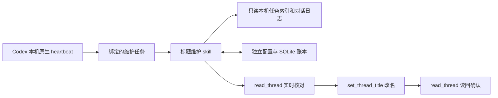

# Codex 任务标题维护

[MIT License](LICENSE)

把本机可管理的 Codex 任务统一命名为 `前缀｜短标题｜MMDD`。支持首次全扫、按 `updated_at` 增量扫描、手动预览与扫描、定时维护，以及可配置的执行模型、时间窗口和命名规则。

仓库提供两个 skill：

| Skill | 用途 |
|---|---|
| `codex-title-maintenance` | 扫描、命名、状态维护、定时启停和配置管理 |
| `codex-title-maintenance-setup` | 首次安装后引导选择默认或自定义配置，解释以后如何使用 |

引导 skill 依赖主 skill；运行实现只保留一份。主 skill 自身包含代码和默认模板，安装子目录即可使用。

## 📥 安装与首次使用

在 Codex 中输入以下请求，安装两个子目录：

```text
请使用 $skill-installer 安装 tyler4400/codex-title-maintenance 中的两个 skill：
- skills/codex-title-maintenance
- skills/codex-title-maintenance-setup
```

按安装器提示让 Codex 识别新安装的 skill，再输入：

```text
$codex-title-maintenance-setup 引导我完成首次配置，可以使用默认设置。
```

引导会检查主 skill、运行环境和能力，创建缺失的个人配置，并说明如何操作。已有配置会保留。**安装与初始化不会自动改名、切换当前任务模型或开启定时计划。**

需要自定义时，可以直接描述偏好：

```text
$codex-title-maintenance-setup 使用北京时间，每天 12 点和 21 点运行，
启动窗口设为 10 分钟。先向我展示命名规则，再保存配置。
```

## ▶️ 日常操作

下列内容是发送给 Codex 的 skill 指令，不是终端命令：

| 请求 | 行为 |
|---|---|
| `$codex-title-maintenance preview full` | 预览全量候选，不实际改名 |
| `$codex-title-maintenance scan full` | 重新发现全部范围内任务并处理 |
| `$codex-title-maintenance scan incremental` | 发现并处理上次扫描以来的变化 |
| `$codex-title-maintenance start` | 开启未来的定时维护，不立即额外扫描 |
| `$codex-title-maintenance stop` | 关闭自动维护，保留进度和手动扫描 |
| `$codex-title-maintenance status` | 查看启停状态、水位、待处理项和错误 |
| `$codex-title-maintenance configure` | 查看或调整个人配置与规则 |
| `$codex-title-maintenance doctor` | 检查环境、存储格式和支持范围 |
| `$codex-title-maintenance unprotect <任务ID>` | 恢复管理一条受到外部标题修改保护的任务 |

推荐首次先预览，再全量处理，最后按需 `start`。未完成首次全扫时，正式增量扫描会先完成全量发现。手动全扫不会清空历史、强制重写所有标题或自动解除保护。

自动维护复用一个由用户选择、绑定的 Codex 任务。推荐使用专用维护任务；只有用户要求创建新任务时才会创建。当前开发或业务任务不会因安装 skill 被自动改成轻量模型，维护任务自身也不会被重命名。

## ⚙️ 工作原理

这个 skill 不使用每轮对话 hook，也不会修改 Codex 自有数据库。`start` 会让 Codex 的本机原生自动化创建或恢复一个绑定到“维护任务”的 heartbeat；到达配置时点后，heartbeat 唤醒该维护任务，由它调用本 skill。



一次自动运行会先检查本地开关和启动窗口，再按成功扫描水位用 `updated_at` 发现变化，向前重叠 5 分钟并用内容指纹去重。候选标题写入前会重新读取任务的标题和状态；只有通过核对后才调用一次改名工具，并在读回标题一致后记入账本。手动标题变化会受到保护，不会被下一轮自动覆盖。

个人配置和账本默认保存在 `${CODEX_HOME}/title-maintenance`（未设置时为 `~/.codex/title-maintenance`），而代码安装在 skill 目录。两者分离，因此更新 skill 不会重置扫描水位、规则或外部标题保护状态。

## ⚙️ 默认设置

- 标题：`前缀｜短标题｜MMDD`，概括整个任务的主线；准确的标题保持稳定。
- 执行模型：建议 `gpt-5.6-luna`，推理强度 `low`；可替换为本机支持的模型与强度，也可选择 `inherit` 保留维护任务现有设置。
- 前缀：`探索、选型、环境、设置、方案、实现、功能、Bug、测试、PR、检索、Git、求知、生活`，共 14 类。
- 日期：最近 assistant 文本消息的日期，按配置时区格式化；缺少时依次回退到用户消息和任务创建时间。日期不是处理标记。
- 范围：包括置顶和归档的受支持本机任务；排除子代理、内部任务、维护任务自身和显式排除项。
- 调度：`Asia/Shanghai`，每天 `10:00、12:00、15:00、17:00、21:00、23:00`。
- 启动窗口：每个时点之后 5 分钟内允许开始自动扫描，手动操作不受窗口限制。
- 增量重叠：从上次成功扫描水位向前多查 5 分钟，以内容指纹去重。
- 外部标题保护：当前标题与上次自动写入的标题不一致时暂停管理该条；首次接管现有标题时没有这个历史依据。

模型、推理强度、六个时点、时区、窗口、范围、标题格式、前缀和语义规则均可配置。第一版原生调度只接受分钟值相同的一组每日时点，例如 `10:00、15:00` 或 `10:30、15:30`；不接受 `10:00、15:30`。配置时区须与本机原生调度时区一致，暂不承诺跨时区调度。详见 [配置说明](skills/codex-title-maintenance/references/configuration.md)。

## 🧠 执行模型如何生效

默认选择 `gpt-5.6-luna` + `low`，是考虑到标题维护主要做受规则约束的归纳与工具编排；官方将 Luna 定位于对成本敏感的大批量工作。这是初始建议，尚未用你的历史任务测量标题质量或额度消耗；模型的 Codex 可用性以安装者本机为准，不用 API 价格换算 Codex 额度。[官方模型说明](https://developers.openai.com/api/docs/models/gpt-5.6-luna)

```toml
[agent]
model = "gpt-5.6-luna"
reasoning_effort = "low"
```

原生 heartbeat 没有独立的模型参数，后续运行继承承载维护任务的模型与推理设置。**写入这份配置只保存偏好，不代表宿主模型已经切换。** `start` 或给已绑定维护任务应用配置时，会先核对该任务的设置。

需要切换时，可通过 `send_message_to_thread` 带上目标模型及强度，向选定维护任务发送一条可见的配置或继续操作消息。这会新增一轮，并改变该维护任务后续默认设置；不是仅限一次的临时覆盖。若目标就是当前维护任务，本轮结束后由设置后的下一轮继续。工具不可用或无法核对时，用户需在维护任务里选择模型后继续。

手动扫描直接使用发起扫描任务的当前模型；要让手动全扫或增量扫描也使用上述配置，请在已核对模型的维护任务中触发。脚本不会在一次已经开始的运行中替换模型。

只保存配置、尚未选择维护任务时，不发送消息、不新建任务。被重命名的普通任务模型始终不变。若以后手动修改维护任务模型，定时运行也会跟随；配置文件不会强行替换每次已启动的模型。暂停或卸载不会自动恢复维护任务旧模型。

希望全部保留原设置，可以将两个字段均设为 `inherit`；单独一个字段为 `inherit` 时只保留该字段。模型不可用时报告问题，不自动换成更高级模型。

定时扫描发现最近持久化模型与配置明确不符时，会跳过处理并报告，保持扫描水位。记录缺失则仍需宿主核验，不能把“未发现不匹配”当作模型已生效。

## 🕒 生效条件、睡眠与重启

这是一项本机 Codex 自动化，必须同时满足以下条件才可能执行：电脑已开机且未处于睡眠；Codex 桌面应用及其本机自动化运行环境可用；已登录并且绑定的维护任务、原生自动化和本地开关均为启用；读取、改名和自动化工具在当时仍可用。关闭 Codex、让电脑睡眠或关机期间不会执行。官方也把“无需电脑打开即可持续运行”的自动化列为正在建设的能力，因此不能把本 skill 当作云端计划服务。[OpenAI 关于 Codex Automations 的说明](https://openai.com/index/introducing-the-codex-app/)

错过一次执行不代表丢失期间的数据。下一次合法运行从上次成功水位继续扫描；`stop` 后重新 `start` 也沿用旧水位。应用恢复后可能补启动一次过期任务，但这不是精确调度承诺；skill 会再次检查启动窗口，窗口外退出且不推进水位。若恰好在窗口内唤醒，仍可能执行。

**关机或重启后的规则：**原生计划和本地账本是持久数据，按设计不需要每次开机都重新运行 `start`。不过“操作系统重启后自动恢复并按时执行”尚未做端到端验收，因此首次重新打开 Codex 后先执行：

```text
$codex-title-maintenance status
```

- 若状态显示本地开关已启用、维护任务和原生自动化仍绑定且已启用，无需再 `start`；等待下一个时间窗口即可。
- 若状态显示暂停、未绑定、调度未同步，或模型核验不匹配，再执行 `$codex-title-maintenance start`；它只恢复未来定时维护，不会立刻扫描。
- 若要在开机后立刻补处理，执行 `$codex-title-maintenance scan incremental`。不要用反复 `start` 代替增量扫描。

原生调度启动维护任务可能调用模型，即使最终没有候选或入口决定跳过，也不能保证零 token 消耗。

## 🔌 兼容性与支持边界

第一版面向 macOS 上的 Codex 桌面应用，需要 Python 3.11 或更高版本，以及可用的应用任务读取、改名、调度工具。脚本只使用 Python 标准库。其他环境须以 `doctor` 和实际验收结果为准。

| 来源或能力 | 当前边界 |
|---|---|
| 本机 Codex 任务 | 读取本地索引和日志，通过应用工具改名 |
| 已归档 Codex 任务 | 纳入，不为改名而解归档 |
| 普通 ChatGPT / ChatGPT Work | 配置保留目标，但当前适配器缺少完整枚举和自动改名入口，报告未支持并跳过 |
| 独立云端、web / mobile 数据源 | 不承诺接入；本机可见不等于工具可完整管理 |
| 纯 CLI 环境 | 可能完成部分读取和诊断；缺少应用工具时不能完成自动改名及原生调度 |

脚本对 Codex 自有数据库只读；索引和日志属于可能变化的内部格式，不是稳定公共 API。遇到不兼容结构应暂停并报告。新来源必须具备完整发现、读取和改名能力后才能声称支持，且使用独立扫描进度。

遇到分叉、回退或缺少原始历史的压缩日志，当前解析器可能无法可靠重建完整主线；这类任务保留待处理并报告原因，不用残缺上下文强行改名。

## 🔄 更新

用户数据默认保存在 `${CODEX_HOME}/title-maintenance`，未设置 `CODEX_HOME` 时位于 `~/.codex/title-maintenance`：

```text
title-maintenance/
├── config.toml          个人配置
├── naming-rules.md      个人命名规则
└── state/
    └── state.sqlite3    水位、待处理项、主线摘要和修改日志
```

代码和默认模板在安装目录，个人配置和账本在外部。初始化和升级不会用默认模板覆盖个人文件。运行账本含有任务 ID、标题和摘要，不应提交到共享仓库。

更新时按以下顺序操作：

1. `$codex-title-maintenance stop`，然后用 `status` 核对本地开关和原生计划都已暂停。
2. 备份个人数据目录，尤其是 `config.toml`、`naming-rules.md` 和 `state/state.sqlite3`。
3. 更新两个已安装的 skill 目录：`codex-title-maintenance` 与 `codex-title-maintenance-setup`。如果通过 `skill-installer` 安装，先确认它支持覆盖；当前安装器通常会拒绝同名目录，因此应按实际安装方式替换**代码目录**，不要删除个人数据目录来“重装”。
4. 运行 `$codex-title-maintenance doctor` 和 `$codex-title-maintenance status`。只有状态显示需要恢复时才再运行 `start`；升级代码本身不意味着必须重新 `start`。

不需要重新初始化水位。若某个未来版本要求状态迁移，应先备份，并遵循该版本的迁移说明；遇到不兼容时停止，不要通过删除账本来强行重试。

## 🗑️ 卸载

1. 运行 `$codex-title-maintenance stop`，再用 `status` 核对本地开关已关闭、绑定的原生计划已暂停。
2. 移除两个已安装的 skill 目录：`codex-title-maintenance` 与 `codex-title-maintenance-setup`。
3. 默认保留 `${CODEX_HOME}/title-maintenance`（或 `~/.codex/title-maintenance`）以便以后重新安装时恢复配置和进度。只有确定不再需要配置、扫描记录和改名 journal 时，才由用户自行删除该个人数据目录。

卸载不会把已经改过的标题自动恢复为旧标题，也不会自动恢复维护任务先前的模型设置。若只是不想自动运行而仍希望保留手动预览、扫描和历史，使用 `stop` 即可，不需要卸载。

## 🧪 开发与验证

核心脚本位于 [主 skill 的 scripts 目录](skills/codex-title-maintenance/scripts/)。测试使用临时数据库和脱敏日志，不应针对真实任务写入。

```bash
python3 -m unittest discover -s tests -v
```

独立阅读、配置和算法测试不能证明应用工具的实际写入、标题实时刷新或睡眠恢复后的调度。发布验收应分别记录这些结果。详细操作流程见 [操作说明](skills/codex-title-maintenance/references/operations.md)。
